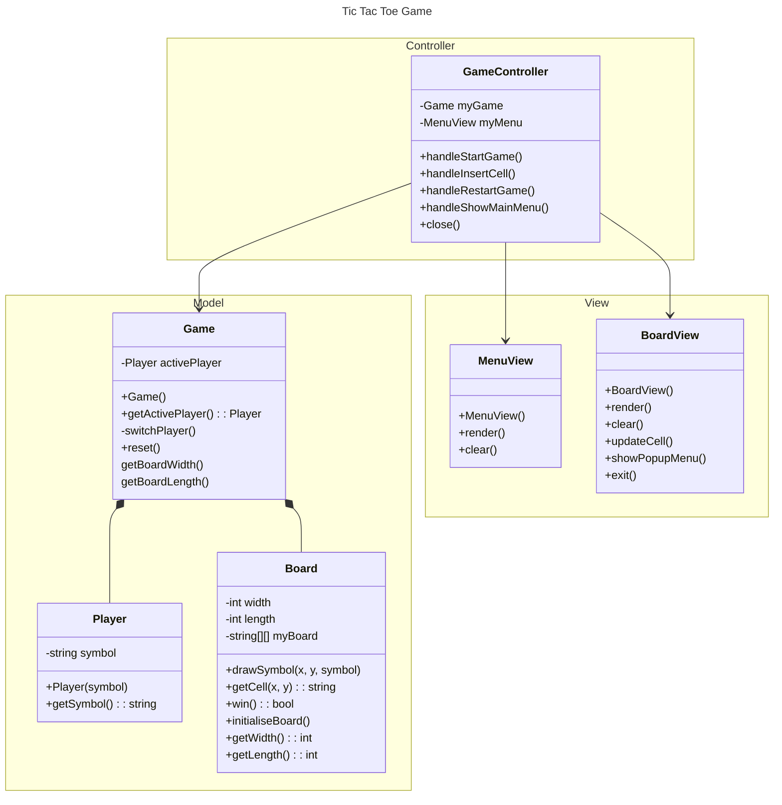

```mermaid
---
title: Tic Tac Toe Game
---

classDiagram

    GameController --> Game
    Game *-- Player
    Game *-- Board
    GameController --> MenuView
    GameController --> BoardView

    namespace Controller {
        class GameController {
            -Game myGame
            -MenuView myMenu
            +handleStartGame()
            +handleInsertCell()
            +handleRestartGame()
            +handleShowMainMenu()
            +close()
        }
    }

    namespace Model {
        class Player {
            -string symbol
            +Player(symbol) 
            +getSymbol(): string
        }

        class Board {
            -int width
            -int length
            -string[][] myBoard
            +drawSymbol(x, y, symbol)
            +getCell(x, y): string
            +win(): bool
            +initialiseBoard()
            +getWidth() : int
            +getLength() : int
        }

        class Game {
            -Player activePlayer
            +Game()
            +getActivePlayer(): Player
            -switchPlayer()
            +reset()
            getBoardWidth()
            getBoardLength()
        }
    }

    namespace View {
        class MenuView {
            +MenuView()
            +render()
            +clear()
        }

        class BoardView {
            +BoardView()
            +render()
            +clear()
            +updateCell()
            +showPopupMenu()
            +exit()
        }
    }

```
